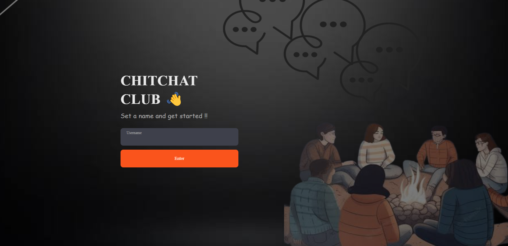

# chitchat-
Abstract:
The Real-Time Chat Application is a modern communication platform that leverages the ChatEngine API, allowing users to engage in real-time conversations, create groups, and seamlessly share files and photos. This project provides a user-friendly interface for efficient communication, backed by a robust technology stack.

technologoes used:
node js
express js
react 
message api

Real-Time Chat: Users can engage in instant, real-time conversations with individuals or groups.
Group Creation: The ability to create and manage groups for collaborative discussions.
File and Photo Sharing: Seamless sharing of files and photos within the chat interface.
Unique User IDs: Users are assigned unique IDs for secure and personalized login.

